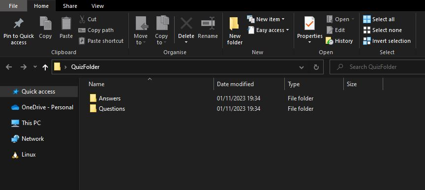
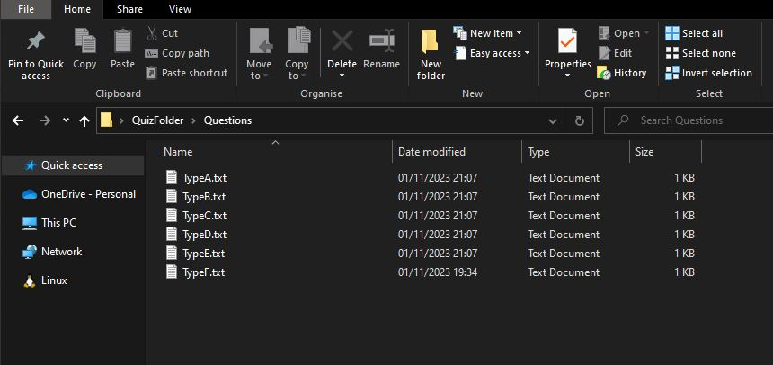
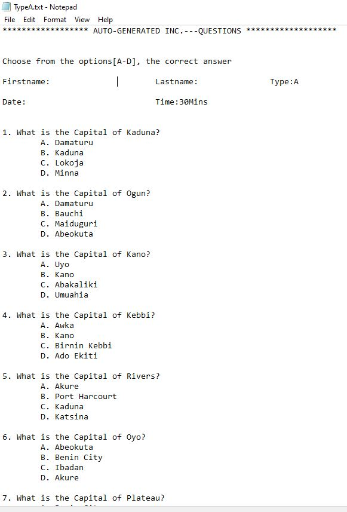
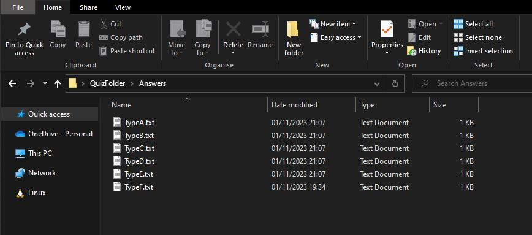
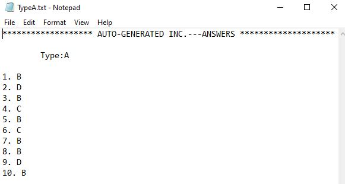

# Quiz Generator

### Installation

#### **1. Clone the repository**
#### **2. cd into the repository**
#### **3. while you are inside the repository, run `./quiz_generator.py` to run the program. Follow the prompts to generate any number of question types and any amount of question per file**

### Usage

This program is most suitable for academic setting where the intention is to reduce cheating. Instead encourage and maximize hardwork of the students.

# Changelog
This file contains the notable changes made to the Quiz Generator project.

## New
	- Added support for linux, mac OS
	- Added the feature to allow users write their own questions and answers
	- Added sample screenshot of the files, types, questions, etc when the script is executed
    - Added cls command to the list
    - Moved the project to remote repository

## Changes
	- Minor changes made to guessing game, rot13, rot47 and my ascii codes to enhance performance

## Fixes
	- each prompts now runs contineously until you enter a valid inut
	- Added execute permission for all user to the files.
    - Fixed response to wrong input entered by users during installation and command execution
	- Removed repeated lines of codes that need not be

##### This is part of some of the programs that I have written so far before I joined ALX.
##### I believe automating some of the things we do everyday is essential for growth. Hence, why I am sharing.

###### We Rise by Lifting Others.